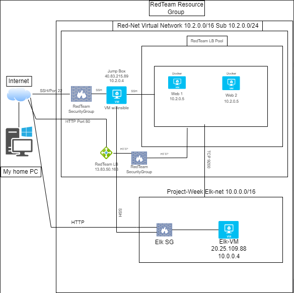
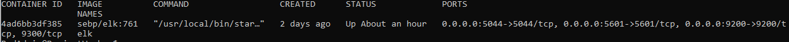

# Bootcamp-Project-Files
This repository displays an Azure cloud network and includes step by step instructions for setting up an automated Elk Stack deployment with Filebeat and Metricbeat. There are pictures in the Images folder of the playbook files running correctly. These pictures include the command to execute an ansible playbook. It also includes a set of Bash scripts that I have written for various practice scenarios. 

## Automated ELK Stack Deployment

The files in this repository were used to configure the network depicted below.

These files have been tested and used to generate a live ELK deployment on Azure. They can be used to either recreate the entire deployment pictured above. Alternatively, select portions of the filebeat-playbook.yml file may be used to install only certain pieces of it, such as Filebeat.

This document contains the following details:
- Description of the Topology
- Access Policies
- ELK Configuration
 - Beats in Use
 - Machines Being Monitored
- How to Use the Ansible Build

### Description of the Topology

The main purpose of this network is to expose a load-balanced and monitored instance of DVWA, the D*mn Vulnerable Web Application.

Load balancing ensures that the application will be highly accessible, in addition to restricting traffic to the network.

The advantage to using a jumpbox is that it automates the process of setting up your other VM's and it restricts access to the rest of our Virtual Network. 

Integrating an ELK server allows users to easily monitor the vulnerable VMs for changes to the log data and system files.

The configuration details of each machine may be found below.
_Note: Use the [Markdown Table Generator](http://www.tablesgenerator.com/markdown_tables) to add/remove values from the table_.

| Name       | Function                 | IP Address | Operating System |
|------------|--------------------------|------------|------------------|
| Jump Box   | Gateway                  | 10.2.04    | Linux            |
| Web 1      | DVWA web server          | 10.2.0.5   | Linux            |
| Web 2      | DVWA web server          | 10.2.0.6   | Linux            |
| Elk Server | search and log analytics | 10.0.0.4   | Linux            |

### Access Policies

The machines on the internal network are not exposed to the public Internet. 

Only the Jump Box machine can accept connections from the Internet. Access to this machine is only allowed from my personal IP address.

Machines within the network can only be accessed by the Jumpbox and its IP is 40.83.215.89

A summary of the access policies in place can be found in the table below.

| Name       | Publicly Accessible | Allowed IP Addresses |
|------------|---------------------|----------------------|
| Jump Box   | yes                 | My Personal IP       |
| Web 1      | No                  | 10.2.0.4(JB IP)      |
| Web 2      | No                  | 10.2.0.4(JB IP)      |
| Elk Server | No                  | 10.2.0.4(JB IP)      |

### Elk Configuration

Ansible was used to automate configuration of the ELK machine. No configuration was performed manually, which is advantageous because… then the user, in this case me, cant mess it up...and its quick and consistent.

The playbook implements the following tasks:

- Install Docker.io, python3-pip, docker module: get, update, and install the docker engine, python and the python client for docker.
- Increase Virtual Memory, Use More memory: Increase and use the amount of virtual memory.
-Download and launch a docker elk container: do exactly that with specific published ports. 

The following screenshot displays the result of running `docker ps` after successfully configuring the ELK instance.

### Target Machines & Beats
This ELK server is configured to monitor the following machines:
	Web1- 10.2.0.5
	Web2- 10.2.0.6

We have installed the following Beats on these machines:
	Filebeat
	Metricbeat

These Beats allow us to collect the following information from each machine:
	
	Filebeat collects log data for each virtual machine. 
	It allows us to see info such as how many visitors we’ve had and if theyve experience any errors.
	It also shows us what processes are running on our connected hosts:
        For example: On Mar 21,2022 @ 19:11:56 a python3 process ran on Web-2.
	Metricbeat collects metrics of the system logs for each VM and outputs CPU and memory usage.

### Using the Playbook
In order to use the playbook, you will need to have an Ansible control node already configured. Assuming you have such a control node provisioned: 

SSH into the control node and follow the steps below:
- Copy the filebeat and metricbeat config and playbook files to the jumpbox.
- Update the config files to include Kabana, elastisearch, the host IP and Port Numbers. 
- Run the playbook, and navigate to the Elk server (http://20.25.109.88:5601/app/kabana) to check that the installation
  worked as expected.
